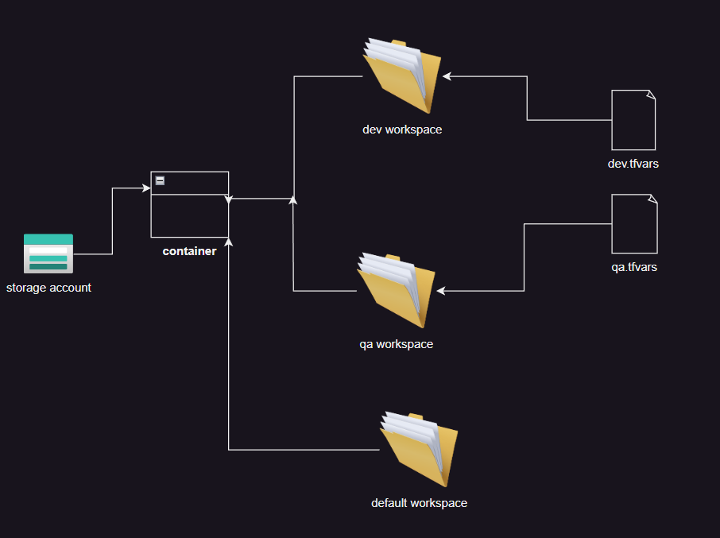
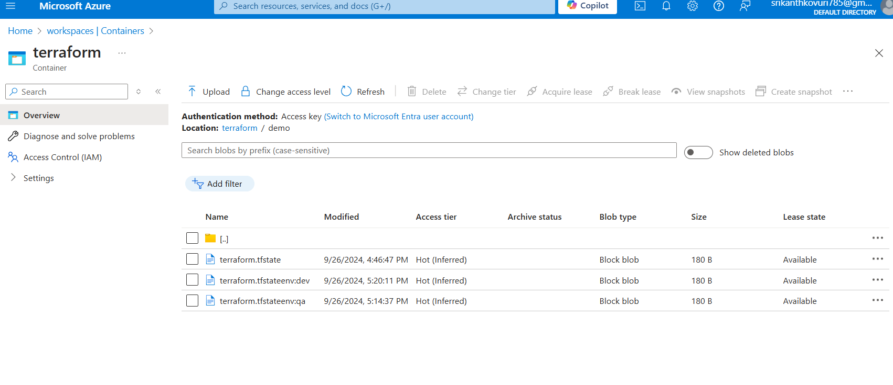

# terraform-workspace

* let's consider a situation where we have to deal with multiple environments
    * Dev
    * Qa
* If someone in our team executing ci/cd pipeline to deal with dev env
    * To avoid creation of same resource multiple times during parallel execution,
        * backend - **common statefile location**
        * ```terraform
            backend "azurerm" {
              resource_group_name  = "terraform"  
              storage_account_name = "workspaces"                      
              container_name       = "terraform"                     
              key                  = "demo/terraform.tfstate" 
            }
            ```
        * place the above code in **providers block**    
    * Initialize the providers, Run
        * ```bash
            terraform init
            ```
     
    * we have to deal with special concept 
        * workspace
        * To add a workspace, Run
        * ```bash
            terraform workspace new "env-name"
            ```
        * To swtch to a workspace, Run
        * ```bash
            terraform workspace select "env-name"
            ```  
        * To apply infra using **tfvars** file, Run
        * ```bash
            terraform apply -var-file="<file-path>"
            ```
* Upon successful completion, We will be able to see
*  
* parallelly, Someone is executing ci/cd pipeline to deal with qa env
* Again create and switch to a workspace and then apply varfile.
* Now, Lock is aquaired for specific workspace
*  We can parrallelly execute our multiple specific environment varfiles